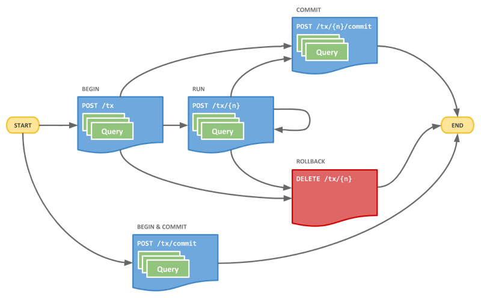

[](https://github.com/hausgold/boltless/actions/workflows/test.yml)
[](https://badge.fury.io/rb/boltless)
[](https://knowledge.hausgold.de/coverage)
[](https://knowledge.hausgold.de/coverage)
[](https://www.rubydoc.info/gems/boltless)

This is a Ruby driver/client for the [neo4j](https://neo4j.com/) [HTTP
API](https://neo4j.com/docs/http-api/current/introduction/). Due to
driver/version incompatibility with the [neo4j-ruby-driver (via
FFI/Seabolt)](https://github.com/neo4jrb/neo4j-ruby-driver) with MRI/CRuby and
neo4j 4.x, we came up with the HTTP API solution. This driver/client was built
with performance in mind, to lower the JSON/HTTP API overhead (compared to the
Bolt protocol (binary)) as much as possible.

All the documented features of the HTTP API are implemented. JSON streams are
enabled to improve performance and lower memory overhead on the server side.
(unfortunately the HTTP API does not stream results in the
[ndjson](http://ndjson.org/) format, which would even be better)

The driver uses a connection pool out of persistent HTTP connections which are
transparently being re-used. The HTTP transportation is done via
[http.rb](https://github.com/httprb/http), a client library which implements
the HTTP protocol natively and outsources the parsing to native extensions.

Due to the fact that the neo4j HTTP API produces and consumes data in the JSON
format, we chose the best in class JSON parsing/serializing libraries
available. For parsing (consuming the HTTP API response, database data) we use
[FastJsonparser](https://github.com/anilmaurya/fast_jsonparser) a Ruby binding
to the [simdjson library](https://simdjson.org/). And for serializing (sending
the Cypher statements) we use [Oj](https://github.com/ohler55/oj), a fast
Object marshaller.

We focus on the bare-metal/low-level neo4j interaction, with raw Cypher. As an
alternative solution with higher abstraction check out
[neo4j-http](https://github.com/doximity/neo4j-http). It provides some clever
CRUD abstrctions like `.upsert_node()` or `.find_nodes_by()`.

- [Installation](#installation)
- [Requirements](#requirements)
- [Usage](#usage)
  - [Configuration](#configuration)
  - [Quick Start](#quick-start)
  - [Transactions](#transactions)
    - [Auto commit/rollback](#auto-commitrollback)
    - [One Shot Transactions](#one-shot-transactions)
  - [Result Mapping](#result-mapping)
  - [Addtional Result Data/Formats](#addtional-result-dataformats)
    - [Include query statistics](#include-query-statistics)
    - [Return results in graph format](#return-results-in-graph-format)
  - [Utilities](#utilities)
    - [Prevent Cypher-Injection](#prevent-cypher-injection)
    - [Prepare a Cypher statement](#prepare-a-cypher-statement)
  - [Operations](#operations)
- [Performance](#performance)
- [Development](#development)
- [Contributing](#contributing)

## Installation

Add this line to your application's Gemfile:

```ruby
gem 'boltless'
```

And then execute:

```bash
$ bundle
```

Or install it yourself as:

```bash
$ gem install boltless
```

## Requirements

* [neo4j](https://neo4j.com/) (>=3.5, all featured tested with 4.4.x)
* [Ruby](https://www.ruby-lang.org/) (>=2.5, tested on CRuby/MRI only, may work
  with other implementations as well)

## Usage

### Configuration

You can configure the Boltless gem in serveral ways. The most relevant settings
should be set on an initializer file when used together with Rails. Here comes
a self descriptive example:

```ruby
# All the configured values here represent the Gem defaults.
Boltless.configure do |config|
  # The base URL of the neo4j HTTP API (port 7474 for HTTP, port 7473
  # for HTTPS when configured at server side)
  config.base_url = 'http://neo4j:7474'

  # The username for the neo4j database (used for HTTP Basic Authentication)
  config.username = 'neo4j'

  # The password for the neo4j database (used for HTTP Basic Authentication)
  config.password = 'neo4j'

  # The default user database of the neo4j instance/cluster, for the
  # community edition this is always +neo4j+, only a single user database is
  # supported with the community editon. You can always specify which
  # database to operate on, on each top-level querying method (eg.
  # +Boltless.execute(.., database: 'custom')+
  config.default_db = 'neo4j'

  # The size of the connection pool, make sure it matches your application
  # server (eg. Puma) thread pool size, in order to avoid
  # timeouts/bottlenecks
  config.connection_pool_size = 10

  # The seconds to wait for a connection from the pool,
  # when all connections are currently in use
  config.connection_pool_timeout = 15.seconds

  # The overall timeout for a single HTTP request (including connecting,
  # transmitting and response completion)
  config.request_timeout = 10.seconds

  # We allow the neo4j server to bootup for the configured time. This allows
  # parallel starts of the user application and the neo4j server, without
  # glitching.
  config.wait_for_upstream_server = 30.seconds

  # Configure a logger for the gem
  config.logger = Logger.new($stdout).tap do |logger|
    logger.level = :warn
  end

  # Whenever we should log the neo4j queries, including benchmarking. When
  # disabled we reduce the logging overhead even more as no debug logs hit
  # the logger at all. Enable this for testing purposes or for local
  # development. (Heads up: No parameter sanitation is done, so passwords etc
  # will be logged with this enabled) Setting the value to +:debug+ will
  # print the actual Cypher statements before any request is sent. This may
  # be helpful inspection of slow/never-ending Cypher statements.
  config.query_log_enabled = false

  # We allow the http.rb gem to be configured by the user for special needs.
  # Just assign a user given block here and you can reconfigure the client.
  # Just make sure to return the configured +HTTP::Client+ instance
  # afterwards.
  config.http_client_configure = proc do |connection|
    # Enable the request/response instrumentation
    # connection.use(instrumentation: {
    #   instrumenter: ActiveSupport::Notifications.instrumenter
    # })

    # Return the configured connection
    connection
  end

  # We allow to check/modify the raw neo4j response body string before it
  # gets JSON parsed and handled. This may be handy for some low-level
  # analyses on the raw responses. The first argument of the user defined
  # block will be the raw response body string and the second it the full
  # HTTP response object (+HTTP::Response+). The user defined block MUST
  # return a JSON parsable string (eg. the original input) in order to
  # continue regular processing.
  config.raw_response_handler = proc do |body, response|
    # Do some checks on the raw/unparsed response body ..

    # Return the original (or modified) response body
    body
  end
end
```

### Quick Start

TL;DR: You just want to run a single Cypher statement, do it like that:

```ruby
result = Boltless.execute!('RETURN date() AS date')
# => #<Boltless::Result
#      columns=[:date],
#      rows=[#<Boltless::ResultRow columns=[:date],
#                                  values=["2022-08-16"],
#                                  meta=[{:type=>"date"}], graph=nil>],
#      stats=nil>

result.value
# => "2022-08-16"
```

This way the Boltless gem sends a single HTTP request to the neo4j HTTP API to
perform the statement and it fetches the results in a lazily mapped way. With
the result mapping you have to pay a little performance penalty, but its only
~3.57% overhead, so its enabled by default. To turn it off, add `raw_results:
true` as addtional keyword argument to all top-level calls. (eg.
`Boltless.execute!('RETURN 1', raw_results: true)`)

### Transactions

We allow the usage of the full [neo4j Cypher transaction
API](https://neo4j.com/docs/http-api/current/actions/transaction-flow/).



* **BEGIN**: `Boltless.transaction(&block)`, `Boltless.transaction!(&block)`
  * **RUN**: `tx.run`, `tx.run!`, `tx.run_in_batch`, `tx.run_in_batch!`
  * **COMMIT**: `tx.commit`, `tx.commit!`
  * **ROLLBACK**: `tx.rollback`, `tx.rollback!`
* **BEGIN & COMMIT**: `Boltless.execute`, `Boltless.execute!`, (aliases are:
  `Boltless.query`, `Boltless.query!`, `Boltless.read`, `Boltless.read!`,
  `Boltless.write`, `Boltless.write!`)
  `Boltless.one_shot(&block)`, `Boltless.one_shot!(&block)`

All the transaction workflow/Cypher executing methods are available in a bang
and non-bang variant. The bang variants will raise on network issues (like
connection failures, timeouts, etc), user issues (like try a write operation
inside a read-only transaction, Cypher syntax errors, etc). The non-bang
variants will suppress these and will return `nil` or `false` (based on the
context). This reflects common Rails/ActiveRecord method behaviour (eg.
`Model.save`/`Model.save!`).

#### Auto commit/rollback

When using the `Boltless.transaction` or `Boltless.transaction!` methods, we
automatically handle the transaction for you. After the end of the user given
block, the transaction will be committed. When an exception is raised from
within the user given block, then the transaction is automatically rolled back.
This is also true for bad interactions with neo4j (eg. sending an Cypher
statement with syntax errors, etc).

Here we setup a transaction with the read-write mode,
on the default database (`neo4j`):

```ruby
Boltless.transaction! do |tx|
  count = tx.run('MATCH (n) RETURN count(n)').value
  # => 5

  # You can also run multiple Cypher statements as
  # batch (within a single HTTP request) like this:
  tx.run_in_batch!(
    ['CREATE (n:User { name: $name, email: $email })',
     name: 'Klaus', email: 'klaus@example.com'],
    ['CREATE (n:User { name: $name, email: $email })',
     name: 'Bernd', email: 'bernd@example.com'],
    ['CREATE (n:User { name: $name, email: $email })',
     name: 'Uwe', email: 'uwe@example.com']
  )

  # Works also for read/query statements:
  pp tx.run_in_batch!(
    ['RETURN 1 AS count'],
    ['RETURN date()'],
    ['MATCH (n:User { name: $name }) RETURN n.email', name: 'Klaus'],
    ['MATCH (n:User) RETURN n.name AS name, n.email AS email LIMIT 10']
  ).map(&:values)
  # => [
  #      # Mapped result values of first statement
  #      [{:count=>1}],
  #      # Mapped result values of second statement
  #      [{:date=>"2022-08-16"}],
  #      # Mapped result values of third statement
  #      [],
  #      # Mapped result values of fourth statement
  #      [
  #        {:name=>"Klaus", :email=>"klaus@example.com"},
  #        {:name=>"Bernd", :email=>"bernd@example.com"},
  #        {:name=>"Uwe", :email=>"uwe@example.com"}
  #      ]
  #    ]

  # The result of the user block is returned as result
  tx.run('MATCH (n) WHERE n.name = $name RETURN count(n)', name: 'Klaus')
end
# => #<Boltless::Result
#      columns=[:"count(n)"],
#      rows=[#<Boltless::ResultRow
#              columns=[:"count(n)"],
#              values=[9],
#              meta=[nil],
#              graph=nil>],
#      stats=nil>
```

#### One Shot Transactions

The neo4j HTTP API allows to send one or multiple Cypher statements in a single
shot transaction endpoint. This can be used with the Boltless gem in
two-flavors. The first is `Boltless.execute(!)` (and their aliases
`Boltless.query(!)`, `Boltless.read(!)`, `Boltless.write(!)`). This one allows
a single Cypher query to be send in this one-shot manner. The other is
`Boltless.one_shot(!)` which allows to send one/more Cypher statements from a
user given block.

```ruby
# Setup a read-only one-shot transaction (see +BEGIN & COMMIT+)
Boltless.one_shot!(:read) do |tx|
  # In this scope you can just prepare the statements which are sent in "one
  # shot" (a single HTTP request) to the neo4j HTTP API, therefore you cannot
  # access the result of each statement after it was added

  tx.add('MATCH (n) RETURN count(n)')
  # => <Boltless::StatementCollector ..>

  tx.add('MATCH (n) WHERE n.name = $name RETURN count(n)', name: 'Klaus')
  # => <Boltless::StatementCollector ..>
end
# => [
#      # Result of the first statement
#      #<Boltless::Result ...>,
#      # Result of the second statement
#      #<Boltless::Result ...>
#    ]
```

### Result Mapping

The Boltless gem allows you to access the Cypher statement result data in a
convenient way like this:

```ruby
Boltless.execute!(
  'MATCH (n:User) RETURN n.name AS name, n.email AS email LIMIT 10',
).map { |row| "#{row[:name]} (#{row[:email]})" }
# => ["Klaus (klaus@example.com)", "Bernd (bernd@example.com)",
#     "Uwe (uwe@example.com)"]
```

If you prefer to work on the raw HTTP API results (eg. for performance
reasons), you can add `raw_results: true` as addtional keyword argument to all
top-level calls. This is how it looks like:

```ruby
Boltless.execute!(
  'MATCH (n:User) RETURN n.name AS name, n.email AS email LIMIT 10',
  raw_results: true
)
# => {:columns=>["name", "email"],
#     :data=>
#      [{:row=>["Klaus", "klaus@example.com"], :meta=>[nil, nil]},
#       {:row=>["Bernd", "bernd@example.com"], :meta=>[nil, nil]},
#       {:row=>["Uwe", "uwe@example.com"], :meta=>[nil, nil]}]}
```

Checkout the [fixtures directory](./spec/fixtures/files) for more HTTP API
response examples.

### Addtional Result Data/Formats

#### Include query statistics

We allow to fetch the query statistics on each individual Cypher statement. The
only thing you need to do is to specify `with_stats: true` as Cypher statement
parameter, like this:

```ruby
Boltless.execute!(
  'CREATE (n:User { name: $name, email: $email })',
  name: 'Monika',
  email: 'monika@example.com',
  with_stats: true
)
# => #<Boltless::Result
#     columns=[],
#     rows=[],
#     stats={:contains_updates=>true,
#      :nodes_created=>1,
#      :nodes_deleted=>0,
#      :properties_set=>2,
#      :relationships_created=>0,
#      :relationship_deleted=>0,
#      :labels_added=>1,
#      :labels_removed=>0,
#      :indexes_added=>0,
#      :indexes_removed=>0,
#      :constraints_added=>0,
#      :constraints_removed=>0,
#      :contains_system_updates=>false,
#      :system_updates=>0}>
```

See the [HTTP API
documentation](https://neo4j.com/docs/http-api/current/actions/include-query-statistics/)
for further details.

#### Return results in graph format

> If you want to understand the graph structure of nodes and relationships
> returned by your query, you can specify the `graph` results data format. This
> is useful when you want to visualize the graph structure. The format collates
> all the nodes and relationships from all columns of the result, and also
> flattens collections of nodes and relationships, including paths.

```ruby
Boltless.execute!(
  'MATCH (n:User) RETURN n.name AS name, n.email AS email LIMIT 10',
  result_as_graph: true
)
# => #<Boltless::Result
#     columns=[:name, :email],
#     rows=[#<Boltless::ResultRow
#       columns=[:name, :email],
#       values=["Klaus", "klaus@example.com"],
#       meta=[nil, nil],
#       graph={:nodes=>[], :relationships=>[]}>,
#      [+3 ..]],
#     stats=nil>
```

See the [HTTP API
documentation](https://neo4j.com/docs/http-api/current/actions/return-results-in-graph-format/)
for further details.

### Utilities

The Boltless gem ships with a set of helpers and utilities for the daily
business of a graph database developer. Check out the following sections!

#### Prevent Cypher-Injection

Just like SQL-Injection, the same thing is doable at your neo4j database with
the Cypher query language. The ultimate Pro Tip is to avoid constructing a
Cypher query (concatenation) with user given inputs. Instead use Cypher
parameters, just like in ActiveRecord/Hibernate this way:

```ruby
class UsersController < ApplicationController
  # [..]

  def new
    # Bad: Don't do this, because of Cypher-Injection.
    Boltless.execute!("CREATE (n:User { name: '#{params[:name]}' })")

    # Good: Use Cypher parameters.
    Boltless.execute!('CREATE (n:User { name: $name })', name: params[:name])
  end
end
```

Yay. This is great. But sometimes this is just not sufficient, because you
cannot wildy place parameters inside the Cypher statement. Like this:

```cypher
// We want to check if a specific user node has a relationship to a specific
// payment node, which reflects that the user can read and write it
 MATCH (s:User { id: $subject_id })
       -[r:READ|WRITE]->
       (o:Payment { id: $payment_id })
RETURN 1
 LIMIT 1
```

Then you cannot use a Cypher parameter for the `s:User` (like
`s:$subject_label`) or `-[r:READ:WRITE]->` (like `-[r:${types}]->`) parts
directly. You could do some glichting with the where statement, but this would
be ugly or non-index using.

Therefore, the Boltless gem ships an utilities to help you with that. See
[Prepare a Cypher statement](#prepare-a-cypher-statement).

#### Prepare a Cypher statement

Ok, you are aware of the Cypher parameters and their shortcommings. The
Boltless gem comes with a utilities named `Boltless.build_cypher`. Use it like
that:

```ruby
cypher = Boltless.build_cypher(
  subject_label: subject.model_name,
  object_label: object.model_name,
  predicate_types: [:read, :write]
) do
  <<~CYPHER
     MATCH (s:%<subject_label>s { id: $subject_id })
           -[r:%<predicate_types>s]->
           (o:%<object_label>s { object_id: $object_id })
    RETURN 1
     LIMIT 1
  CYPHER
end
# => " MATCH (s:User { id: $subject_id })\n" +
#    "       -[r:READ|WRITE]->\n" +
#    "       (o:Payment { id: $object_id })\n" +
#    "RETURN 1\n" +
#    " LIMIT 1"
```

This utility takes care of correct Cypher escaping, based on the parameters (by
name) you pass in. Parameters ending with:

* `_label(s)` are treated as node labels and are camelized
  and joined with colons
* `_type(s)` are treated as relationship types and are uppercased
  and joined with pipes
* `_str(s)` are treated as free-text, it will be escaped properly
  with double quotes

When the given string(s) include special characters they will be escaped with
backticks respectively.

**Heads up!** Do not use the `Boltless.build_query` utility blindly with
**ALL** of your variables. Whenever possible use the native Cypher parameters
as this helps the neo4j database to re-use already parsed Cypher statements,
and therefore results in better performance.

Furthermore, you can use the `Boltless.build_cypher` utility directly within
transaction contexts like this:

```ruby
# Can directly be used in a regular transaction:
Boltless.transaction! do |tx|
  # tx: Boltless::Transaction

  cypher = tx.build_cypher(
    # [your parameters]
  ) do
    # [your Cypher template]
  end
  tx.run!(cypher, param_a: 7892)
end

# And also in a one-shot transaction:
Boltless.one_shot! do |tx|
  # tx: Boltless::StatementCollector

  cypher = tx.build_cypher(
    # [your parameters]
  ) do
    # [your Cypher template]
  end
  tx.add(cypher, param_a: 7892)
end
```

### Operations

We also allow to handle the common neo4j database operations in a seamless way.
This includes adding/dropping indexes/constraints, full database cleanups and
index/constraints listing. Take a look at the following example:

```ruby
# Add a new index for user (+User+ labeled nodes) +id+ properties,
# this may be helpful for querying/merging later
Boltless.add_index(name: 'user_id',
                   for: '(n:User)',
                   on: 'n.id')

# Add a new constraint, to enforce unique user
# emails across all +User+ labeled nodes
Boltless.add_constraint(name: 'uniq_user_email',
                        for: '(n:User)',
                        require: 'n.email IS UNIQUE')

# Fetch the index names of the +neo4j+ database,
# you can also specify the +database+ argument to every querying
# method in order to specify the database in use
Boltless.index_names(database: 'neo4j')
# => ["user_id"]

# Fetch the constraint names of the +neo4j+ database (by default)
Boltless.constraint_names
# => ["uniq_user_email"]

# Drop an index by its name. When it does not exists
# this method does not raise errors.
Boltless.drop_index('user_id')

# Drop a constraint by its name. When it does not exists
# this method does not raise errors.
Boltless.drop_constraint('uniq_user_email')

# Clear the neo4j database (remove all indexes, constraints,
# nodes and relationships)
Boltless.clear_database!
```

## Performance

Fetching a large result (68.845 rows, 8.73 MB raw JSON) from neo4j results in:

* 1.52971222s (avg), when the raw result is used (no restructuring in Ruby)
* 1.58435011s (avg, ±1.0x same-ish, ~3.57%), when the result is restructured in
  Ruby (but lazily mapped)

Another interesting comparison looks at some of our production workloads:

| Operation(avg)  | Bolt (neo4j-ruby-driver)   | HTTP API (neo4j-http)   | HTTP API (Boltless)    |
| --------------- | -------------------------- | ----------------------- | ---------------------  |
| read many rows  | 191ms (±1x base)           | 316ms (1.7x slower)     | 258ms (1.4x slower)    |
| read single row | 52ms (±1x base)            | 52ms (±1.0x same-ish)   | 53ms (±1.0x same-ish)  |
| write           | 350ms (±1x base)           | 289ms (1.2x faster)     | 291ms (1.2x faster)    |
|                 | 198ms (±1x base)           | 219ms (1.1x slower)     | 201ms (±1.0x same-ish) |

## Development

After checking out the repo, run `make install` to install dependencies. Then,
run `make test` to run the tests. You can also run `make shell-irb` for an
interactive prompt that will allow you to experiment.

To release a new version, update the version number in `version.rb`, and then
run `make release`, which will create a git tag for the version, push git
commits and tags, and push the `.gem` file to
[rubygems.org](https://rubygems.org).

## Contributing

Bug reports and pull requests are welcome on GitHub at
https://github.com/hausgold/boltless.
